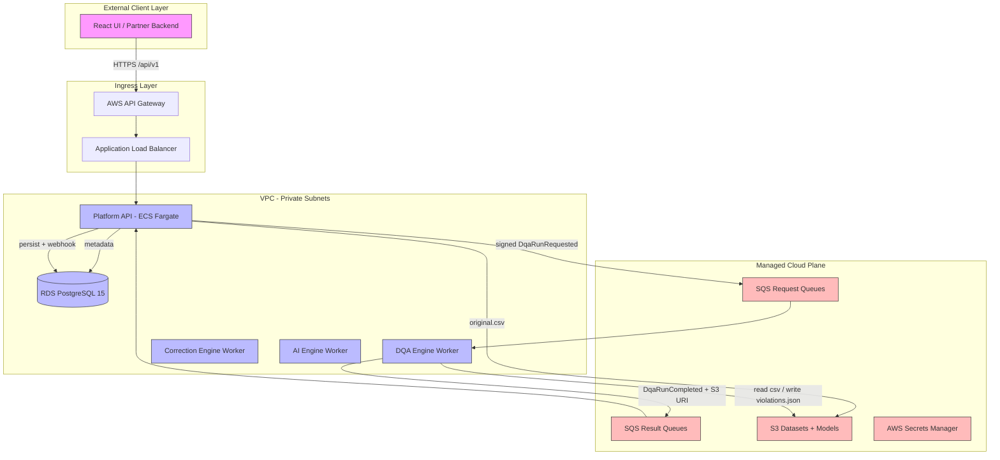

# DataSentinel — Platform Migration & Build Plan

**From in-process monolith → distributed, AWS-ready, event-driven services.**

This is the **execution plan** for rebuilding the legacy DataSentinel (DQA) backend as a set of independently deployable services in this `DQA/` workspace. It turns the design in [`PLATFORM_API_ARCHITECTURE.md`](../docs/PLATFORM_API_ARCHITECTURE.md) and the service map in [`BACKEND_SERVICES.md`](../docs/BACKEND_SERVICES.md) into a phased, checklist-driven roadmap you can develop against, grounded in the actual legacy code under [`backend/`](../backend).

> **How to use this doc:** Work top-to-bottom. Sections 0–6 are the *what and why* (read once). Section 7 is the *plan to build* — phases are ordered for safe, incremental delivery (strangler-fig). Each phase has a Goal, a task checklist, the legacy files it touches, and an explicit **Definition of Done**. Sections 8–11 are reference specs you pull from as phases require them.

---

## 0. Objective & Scope

| | |
|---|---|
| **Objective** | Expose all data-quality capabilities through a single public **Platform API** while the four compute engines run as private, horizontally-scalable, stateless workers. |
| **In scope** | Decoupling the monolith, S3 object storage, SQS event flow, internal service auth, multi-tenancy, AWS deployment via CloudFormation, CI/CD. |
| **Out of scope (initial)** | Replacing the React frontend, SSO/Cognito migration, real-time streaming ingestion, MLflow-managed registry (S3 registry first; MLflow optional later). |
| **Success criteria** | (1) A client triggers a DQA run via `POST /api/v1/runs/` and the work executes in a separate worker with no in-process engine import in the API. (2) Engines hold **no** DB connection and **no** user context. (3) Everything deploys to AWS from IaC with one command per environment. |

---

## 1. Source of Truth

| Document | Role |
|----------|------|
| [`docs/PLATFORM_API_ARCHITECTURE.md`](../docs/PLATFORM_API_ARCHITECTURE.md) | Target architecture, auth planes, repo split, AWS services, API contract. |
| [`docs/BACKEND_SERVICES.md`](../docs/BACKEND_SERVICES.md) | Map of the four logical services in today's monolith and their source paths. |
| [`backend/`](../backend) | Legacy code being migrated. **The current behavior here is the spec** for the extracted services. |
| **This doc** | The build plan that sequences the above into deliverable phases. |

When this plan and the architecture doc disagree, the architecture doc wins on *design intent*; this plan wins on *sequencing and concrete tasks*.

---

## 2. Current State (verified against `backend/`)

The monolith is a single FastAPI process (port 8000) plus a Celery worker, sharing one PostgreSQL DB and a local upload volume.

**Stack:** Python 3.11 · FastAPI · SQLAlchemy 2 · Pydantic v2 · PostgreSQL 15 · Redis 7 · Celery 5.4 · pandas · scikit-learn.

### 2.1 What's already in good shape

- **Engines are pure and stateless.** `DQAEngine.run(df, rules)` and `RuleBasedCorrectionEngine.generate(df, violations, rules)` take plain data and return plain results — no DB, no I/O. They port cleanly into workers.
- **Clear router/engine separation.** `app/api/v1/*` orchestrates; `app/engines/*` computes.
- **Audit logging** already exists (`audit_log` table written on major actions).

### 2.2 Known defects & gaps to fix during migration

These are the concrete things the migration must correct. Each is referenced by the phase that resolves it.

| # | Issue | Evidence (legacy) | Fixed in |
|---|-------|-------------------|----------|
| D1 | **Celery task signature mismatch.** `run_dqa_task` calls `_execute_dqa(run_id, db)` (2 args) but `_execute_dqa(run_id)` takes 1 → `TypeError`. The Celery path is also dead code (API uses `BackgroundTasks`). | `backend/app/tasks/dqa_tasks.py:9` vs `backend/app/api/v1/runs.py:25` | Phase 0 |
| D2 | **In-process execution.** `POST /runs/` runs `DQAEngine` via `BackgroundTasks` inside the API process — no isolation, no independent scaling. | `runs.py:88-103` | Phase 2–3 |
| D3 | **Local filesystem storage.** Datasets saved to `UPLOAD_DIR`; `_load_df` reads `storage_path` from disk (duplicated in `runs.py` and `corrections.py`). | `datasets.py:58-83`, `runs.py:16-23`, `corrections.py:16-22` | Phase 0 (interface) → Phase 2 (S3) |
| D4 | **No multi-tenancy.** None of the 11 tables has `tenant_id`; JWT carries only `sub=email` + `role`. | `models/__init__.py`, `core/security.py:20-43` | Phase 0 (schema) + Phase 7 (claims) |
| D5 | **AI models cached in-memory.** `AICorrectionEngine._models` dict is lost when a task dies; inconsistent across replicas; training runs synchronously inside `predict`. | `engines/correction/engine.py:146-185` | Phase 5 |
| D6 | **AI engine not wired in.** `corrections.py` `generate` only calls `RuleBasedCorrectionEngine`; `AICorrectionEngine.predict()` is never invoked. | `corrections.py:69-70` | Phase 5 |
| D7 | **Single shared DB for everything.** Target: only Platform API owns the DB; engines own none. | all routers | Phase 3–5 |
| D8 | **No internal auth.** No message signing, no anti-replay, no service identity. | (absent) | Phase 1–2 |
| D9 | **Minimal config.** `config.py` has no S3/SQS/signing-key/AWS settings. | `core/config.py` | Phase 0 |

> **Note on tenancy (D4):** The legacy schema has *no* tenant columns, so introducing `tenant_id` is a **new migration**, not a verification. Keep it nullable + backfilled to a default tenant first to avoid breaking existing rows.

---

## 3. Target Architecture

Stateless engines run as private ECS Fargate workers, reachable only through the public Platform API and decoupled via SQS + S3.



**Invariants:**
- Only Platform API has a public endpoint and a DB connection.
- Engines are stateless: read S3, compute, publish a result event. No user identity, no DB.
- All cross-service calls carry a **signed, expiring** job envelope.

---

## 4. Guiding Principles

| Principle | What it means in practice |
|-----------|---------------------------|
| **Contracts-first** | Define event/result/violation schemas in `datasentinel-contracts` *before* wiring producers/consumers. Pin the version in every service. |
| **Stateless workers** | No worker keeps state between messages. Models, datasets, and results live in S3; metadata in RDS via the API. |
| **One owner per datastore** | Platform API owns RDS. Engines own nothing persistent except S3 artifacts they write. |
| **Two auth planes** | External (users/partners → API: JWT/API-key/client-credentials). Internal (API → engines: HMAC-signed SQS envelopes + IAM task roles). Never forward a user token to a worker. |
| **Idempotency** | `job_id == run_id`. Workers skip already-processed jobs; consumers upsert. |
| **Strangler-fig** | Keep the monolith running. Extract one capability at a time behind a flag; cut over only when the new path is proven. |
| **Offload large payloads** | SQS messages carry **S3 URIs**, never large violation/suggestion lists (256 KB limit). |
| **IaC + immutable images** | Every environment is reproducible from CloudFormation; deploy by image tag = git SHA. |

---

## 5. Critical Design Decisions

### 5.1 SQS 256 KB limit → S3 payload offloading

A DQA run on a large dataset can produce a violations list far exceeding SQS's **256 KB** message cap. Engines must therefore never inline large arrays.

**Pattern:**
1. Worker computes the full violations list.
2. Worker serializes it and writes to `s3://datasentinel-datasets-{env}/tenants/{tenant_id}/runs/{run_id}/violations.json`.
3. Worker sends a *small* result event containing the **S3 URI** plus summary metrics.
4. Platform API result consumer downloads the JSON, parses it, and bulk-inserts into PostgreSQL.

```json
{
  "schema_version": "1.0",
  "event_type": "dqa.run.completed",
  "job_id": "550e8400-...",
  "correlation_id": "660e8400-...",
  "status": "completed",
  "gate_passed": false,
  "readiness_score": 72.5,
  "dimension_scores": { "integrity": 0.85 },
  "rules_executed": 28,
  "violations_s3_uri": "s3://datasentinel-datasets-prod/tenants/770e.../runs/550e.../violations.json",
  "error_message": null
}
```

> The legacy `DQAEngine.run()` already returns `dimension_scores` with **lowercased** keys (`integrity`, not `Integrity`). Keep the contract consistent with what the engine emits, or normalize in one place — don't let producer/consumer disagree.

### 5.2 Job & result envelope + internal auth

Every dispatched job is wrapped in a signed envelope (full request schema in [PLATFORM_API_ARCHITECTURE §Job envelope](../docs/PLATFORM_API_ARCHITECTURE.md#job-envelope-internal-message-contract)). Sign with HMAC-SHA256 using `INTERNAL_MESSAGE_SIGNING_KEY` from Secrets Manager.

**Anti-replay rules:**
- Envelope carries `issued_at` + `expires_at` (10–15 min window). Workers reject expired messages immediately.
- Stable serialization (`json.dumps(payload, sort_keys=True)`) so signatures are deterministic.
- Compare with `hmac.compare_digest` (constant-time).

```python
import hmac, hashlib, json

def sign(payload: dict, secret: str) -> str:
    body = json.dumps(payload, sort_keys=True, separators=(",", ":")).encode()
    return hmac.new(secret.encode(), body, hashlib.sha256).hexdigest()

def verify(payload: dict, signature: str, secret: str) -> bool:
    return hmac.compare_digest(sign(payload, secret), signature)
```

### 5.3 AI model registry (S3) + async retraining

Replaces the in-memory `self._models` cache (D5).

- **Storage:** `s3://datasentinel-models-{env}/projects/{project_id}/{field_name}/{error_type}/model.joblib` (serialize with `joblib`).
- **Inference:** check local task cache → load `.joblib` from S3 → if absent, fall back to the rule-based engine. Never train inside the prediction path.
- **Retraining (event-driven):**

```
approve correction → write ai_training_feedback
   → count feedback for (project, field, error_type)
   → if count crosses threshold (legacy MIN_SAMPLES = 50)
   → publish ai.training.triggered
   → AI worker trains GradientBoostingRegressor, writes model.joblib to S3
```

> Legacy features are `lag_1, lag_2, rolling_mean, rolling_std, hour_of_day`; target is the approved corrected value. Docstrings mention XGBoost but the code uses `GradientBoostingRegressor` — keep that unless you deliberately upgrade.

### 5.4 Storage abstraction (local FS → S3)

`_load_df` is duplicated in `runs.py` and `corrections.py` and reads from local disk (D3). Introduce a single storage interface so the cutover to S3 is a config flip, not a rewrite.

```python
class DatasetStore(Protocol):
    def load_df(self, uri: str) -> "pd.DataFrame": ...
    def save_bytes(self, uri: str, data: bytes) -> None: ...

# LocalDatasetStore (today)  →  S3DatasetStore (target)
```

Replace `Dataset.storage_path` (local path) with `Dataset.s3_uri` once S3 is live; keep both columns during transition.

### 5.5 Multi-tenancy

Add `tenant_id` (UUID) to `projects`, `datasets`, `dqa_runs`, `dqa_violations`, and the correction tables. Backfill existing rows to a single default tenant, then make it non-nullable. Every API query filters by the `tenant_id` claim in the token; the job envelope carries `tenant_id` for S3 key scoping and audit.

---

## 6. Workspace & Repository Layout

**Decision (revisit anytime):** Develop all services in this single `DQA/` repo as a **monorepo with per-service folders**, structured so each folder can later be split into its own repo (polyrepo) without moving code. This keeps a solo/small-team workflow fast while honoring the architecture's six-service boundary. The shared contracts package is the only code shared across services and is consumed as a versioned dependency, never via relative imports.

```
DQA/
├── PLATFORM_MIGRATION_GUIDE.md      # this plan
├── Makefile                         # build/deploy orchestration (§9)
├── scripts/cfn-deploy.sh            # safe CloudFormation deploy (§9)
├── datasentinel-contracts/          # shared event/schema package (publish to CodeArtifact)
├── datasentinel-platform-api/       # public REST API, DB, orchestration  ← only DB + public access
├── datasentinel-dqa-engine/         # DQA worker (SQS consumer, no DB)
├── datasentinel-correction-engine/  # rule-based correction worker (no DB)
├── datasentinel-ai-engine/          # ML worker + S3 model registry (no DB)
└── datasentinel-infra/              # CloudFormation foundation + per-service stacks
```

### Extraction map (legacy → target)

| Legacy path | Target service | Transformation |
|-------------|----------------|----------------|
| `app/api/v1/*` | `platform-api` | Routers become orchestration-only; `runs.py`/`corrections.py` publish to SQS instead of calling engines. |
| `app/core/{config,database,security,startup}.py` | `platform-api` | Extend auth with API keys, scopes, client credentials, `tenant_id`; add S3/SQS/signing config. |
| `app/models/*`, `app/schemas/*` | `platform-api` | Platform DB owns all workflow tables; add `tenant_id`. |
| `app/engines/dqa/engine.py` | `dqa-engine` | Copy as-is; strip nothing (already pure). Wrap with SQS consumer + S3 I/O. |
| `app/engines/correction/engine.py` → `RuleBasedCorrectionEngine` | `correction-engine` | Copy; wrap with consumer + S3 I/O. |
| `app/engines/correction/engine.py` → `AICorrectionEngine` | `ai-engine` | Refactor `_get_or_train`/`_predict_single` to use S3 `.joblib` registry (§5.3). |
| `app/tasks/*` | per-engine consumers | Drop the broken Celery wrapper (D1); each worker owns its SQS poll loop. |
| `backend/migrations/init.sql` | `platform-api` | Engines never own schema; add tenant migration. |
| `data/sample_data/*` | `contracts` or `platform-api/tests` | Integration test fixtures. |

> **Shared `ViolationRecord` / `CorrectionSuggestionRecord`:** these helper classes (defined in the engines today) become the canonical schemas in `datasentinel-contracts/schemas/`. Engines and the API both import them from the package — no copy-paste.

---

## 7. Phased Development Plan

Phases are ordered so the system stays runnable at every step. Don't start a phase until the previous one's **Definition of Done** is met.

```
Phase 0 ─► Phase 1 ─► Phase 2 ─► Phase 3 ─► Phase 4 ─► Phase 5 ─► Phase 6 ─► Phase 7
Stabilize   Contracts   Platform   DQA        Correction  AI         Infra/     Hardening
monolith    package     API +S3    worker     worker      worker     CICD       multi-client
                        +SQS
```

---

### Phase 0 — Stabilize & decouple the monolith *(in `backend/`)*

**Goal:** Make the legacy code safe to split without changing observable behavior.

- [ ] **Fix D1:** delete the broken Celery `_execute_dqa(run_id, db)` call. Either drop `app/tasks/` entirely (API doesn't use it) or correct the signature to single-arg.
- [ ] **Fix D3 (interface only):** introduce `DatasetStore` protocol; replace both duplicate `_load_df` functions with one `LocalDatasetStore`. No S3 yet — just the seam.
- [ ] **Fix D4 (schema):** add nullable `tenant_id` to `projects`, `datasets`, `dqa_runs`, `dqa_violations`, `correction_rules`, `correction_suggestions`, `approved_corrections`, `ai_training_feedback`; backfill a default tenant.
- [ ] **Fix D9:** extend `config.py` with `S3_DATASETS_BUCKET`, `SQS_*_URL`, `INTERNAL_MESSAGE_SIGNING_KEY`, `AWS_REGION`, `ENVIRONMENT` (read from env; safe defaults for local).
- [ ] Extract the dataset-loading and result-shaping logic from `runs.py:_execute_dqa` into a thin orchestration function so the SQS dispatch can replace it later with minimal diff.

**Touches:** `tasks/dqa_tasks.py`, `api/v1/runs.py`, `api/v1/corrections.py`, `api/v1/datasets.py`, `core/config.py`, `models/__init__.py`, `migrations/init.sql`.

**Definition of Done:** Monolith boots, runs a DQA job end-to-end via `BackgroundTasks`, all queries are tenant-aware, and there is exactly one storage abstraction. No `TypeError` path remains.

---

### Phase 1 — `datasentinel-contracts`

**Goal:** One versioned source of truth for every cross-service message and shared record.

- [ ] Create the package skeleton:

```
datasentinel-contracts/
├── pyproject.toml
└── datasentinel_contracts/
    ├── events/      base.py (JobEnvelope, AuditContext) · dqa.py · correction.py · ai.py
    ├── schemas/     violation.py · suggestion.py · rule.py
    └── constants/   dimensions.py  (DIMENSION_WEIGHTS from DQAEngine)
```

- [ ] Model `JobEnvelope`, `DqaRunRequested`, `DqaRunCompleted`, `CorrectionRequested`, `CorrectionCompleted`, `AiPredictRequested`, `AiTrainingTriggered` as Pydantic v2 models matching §5.1/§5.2.
- [ ] Move `ViolationRecord` and `CorrectionSuggestionRecord` here (from the engines) and `DIMENSION_WEIGHTS` (from `dqa/engine.py:28`) into `constants/dimensions.py`.
- [ ] Add the HMAC `sign`/`verify` helpers (§5.2) under `events/`.
- [ ] Publish to AWS CodeArtifact (or GitHub Packages); pin the version in each service `requirements.txt`.

**Definition of Done:** `pip install datasentinel-contracts==x.y.z` works; round-trip serialize/sign/verify of every envelope is covered by unit tests.

---

### Phase 2 — `datasentinel-platform-api`

**Goal:** Public API on AWS that uploads to S3 and dispatches jobs to SQS — still allowed to run DQA in-process behind a feature flag until Phase 3 proves the worker.

- [ ] Fork `backend/` → `datasentinel-platform-api`; carry over `api/`, `core/`, `models/`, `schemas/`, `migrations/`.
- [ ] Implement `services/storage.py` (`S3DatasetStore`): upload datasets to `s3://.../tenants/{tenant_id}/datasets/{id}/original.csv`; store `s3_uri` on the dataset row.
- [ ] Implement `services/job_dispatcher.py`: build + sign + `SendMessage` to the DQA request queue.
- [ ] Implement `services/result_consumer.py` + `workers/result_worker.py`: long-poll the completed queue, download `violations.json` from S3, bulk-insert, update run status, fire webhooks.
- [ ] Refactor `api/v1/runs.py` `POST /` to: validate auth + project access → `INSERT dqa_runs(status=queued)` → snapshot rules → publish `DqaRunRequested` → return `202`. (Replaces D2's `BackgroundTasks`.)
- [ ] Keep the in-process path behind `DQA_EXECUTION_MODE={inprocess|sqs}` so cutover is reversible.
- [ ] Containerize (`Dockerfile`) and deploy to ECS Fargate behind ALB (uses foundation stack from Phase 6 — deploy foundation first if doing AWS now).

**Touches → target:** `api/v1/runs.py`, `api/v1/datasets.py`, new `services/`, new `workers/`, `core/config.py`, `core/internal_auth.py`.

**Definition of Done:** Upload lands in S3; `POST /runs/` returns `202` and enqueues a signed message; with `DQA_EXECUTION_MODE=inprocess` the full flow still completes and persists results.

---

### Phase 3 — `datasentinel-dqa-engine`

**Goal:** Move DQA execution out of the API into an independently scaling worker.

```
datasentinel-dqa-engine/
├── Dockerfile · requirements.txt   # pandas, numpy, boto3, datasentinel-contracts
├── app/
│   ├── main.py        # entry point
│   ├── consumer.py    # poll dqa-run-requested, verify signature + expiry
│   ├── storage.py     # download CSV / upload violations.json (S3)
│   └── engine/rules.py  # copied verbatim from backend/app/engines/dqa/engine.py
└── tests/test_dqa_rules.py
```

- [ ] Copy `dqa/engine.py` into `app/engine/rules.py` unchanged (it's already DB-free).
- [ ] `consumer.py`: verify signature + `expires_at` (§5.2), idempotency on `job_id`, download CSV from S3, run `DQAEngine.run(df, rules_snapshot)`.
- [ ] Offload violations to S3 and publish `DqaRunCompleted` with the URI (§5.1).
- [ ] Port the legacy rule-fixtures into `tests/` so engine output is regression-locked before the cutover.
- [ ] Switch Platform API to `DQA_EXECUTION_MODE=sqs`; **remove the `DQAEngine` import** from the API once green (resolves D2/D7).
- [ ] Autoscale on `ApproximateNumberOfMessagesVisible`.

**Definition of Done:** A run triggered through the API executes entirely in the worker; the API repo no longer imports any engine; results match the legacy fixtures byte-for-byte (modulo non-determinism).

---

### Phase 4 — `datasentinel-correction-engine`

**Goal:** Same pattern as Phase 3 for deterministic rule-based corrections.

- [ ] Copy `RuleBasedCorrectionEngine` → `app/engine/rules.py`.
- [ ] `consumer.py` polls `correction-requested`; loads dataset + violations (violations via S3 URI from the run); runs `generate(df, violations, correction_rules)`.
- [ ] Offload suggestions to S3; publish `CorrectionCompleted`.
- [ ] Rewire `api/v1/corrections.py` `POST /generate/{run_id}` to dispatch to SQS; result consumer persists suggestions (`suggestion_source="rule_engine"`).
- [ ] Preserve the existing approve/reject/bulk-approve/apply/export workflow in the API — those stay DB-side and unchanged.

**Definition of Done:** Generating suggestions goes through the worker; suggestions persist with the correct source; the approval workflow still writes `approved_corrections` + `ai_training_feedback`.

---

### Phase 5 — `datasentinel-ai-engine`

**Goal:** Wire AI predictions in (D6) and make models durable + training async (D5).

- [ ] Copy `AICorrectionEngine`; **refactor** `_get_or_train` to load/save `.joblib` from the S3 model registry (§5.3) and `_predict_single` to load on demand; drop the in-memory `self._models` as source of truth (local cache only).
- [ ] `consumer.py` handles two event types: `AiPredictRequested` (inference) and `AiTrainingTriggered` (retrain → write model to S3).
- [ ] In the API approval path, after writing `ai_training_feedback`, count samples per `(project, field, error_type)`; when it crosses `MIN_SAMPLES` (50), publish `AiTrainingTriggered`.
- [ ] Wire AI suggestions into the generate flow: run AI alongside/instead of the rule engine when a trained model exists; otherwise fall back. Tag with `suggestion_source="ai_engine"`.

**Definition of Done:** With ≥50 approved corrections for a pair, a trained model is produced in S3 and AI suggestions appear; with fewer, the system cleanly falls back to rule-based with no errors.

---

### Phase 6 — `datasentinel-infra` (CloudFormation + CI/CD)

**Goal:** Reproducible AWS environments and one-command deploys. (Can be brought forward and run in parallel with Phase 2 if deploying to AWS early.)

- [ ] Foundation stack: VPC (2 AZ), public/private subnets, NAT, **VPC Gateway Endpoints for S3 + SQS** (cost: avoids NAT data charges), RDS PostgreSQL 15, S3 buckets, SQS queue pairs + DLQs, Secrets Manager, ECR repos. Export outputs for service stacks (§8).
- [ ] Per-service stacks (ECS Fargate task + service, IAM task roles, autoscaling, log groups). Platform API gets an ALB; engines get **none**.
- [ ] Root `Makefile` + `scripts/cfn-deploy.sh` for change-set-validated deploys (§9).

**Definition of Done:** `make deploy-infra ENV=dev` then `make deploy-services ENV=dev` stand up the whole platform from scratch in a clean account.

---

### Phase 7 — Multi-client hardening

**Goal:** Make the API safe for partners and multiple UIs.

- [ ] Extend `security.py`: `api_clients` table, `POST /auth/client-token` (client credentials), `type`/`tenant_id`/`scopes` in JWT claims (resolves the claims half of D4).
- [ ] `@require_scope("dqa:run")` style authorization; enforce `tenant_id` isolation on every query.
- [ ] Webhooks: `POST /webhooks` registration + signed `X-DataSentinel-Signature` callbacks on completion.
- [ ] API standards: RFC 7807 errors, cursor pagination, `Idempotency-Key` on `POST /runs/`, `X-Correlation-Id` propagation, API Gateway usage-plan rate limits.
- [ ] Observability: CloudWatch logs/metrics + X-Ray traces across the SQS hops.

**Definition of Done:** A partner can obtain a client token, trigger a run scoped to its tenant, and receive a verified webhook — with rate limits and per-tenant isolation enforced.

---

## 8. AWS Infrastructure Reference

### 8.1 Network & security boundaries

```
VPC 10.0.0.0/16
├── Public subnets (AZ1/AZ2): NAT Gateways, ALB (Platform API only, TLS termination)
└── Private subnets (AZ1/AZ2):
    ├── Platform API task   (ingress from ALB SG only)
    ├── Engine workers      (no ingress; egress to SQS/S3 only)
    ├── RDS PostgreSQL      (5432 from Platform API SG only)
    └── ElastiCache Redis   (optional; 6379 from Platform API SG only)
```

> **Cost optimization:** Configure **VPC Gateway Endpoints for S3 and SQS**. Large datasets through NAT cost ~$0.045/GB plus ~$32/mo per NAT; endpoints route engine traffic privately and bypass those fees.

### 8.2 SQS queue design

| Queue | Producer | Consumer | Visibility | Retention | Redrive |
|-------|----------|----------|-----------|-----------|---------|
| `dqa-run-requested-{env}` | Platform API | DQA worker | 900s | 4 days | 3 → DLQ |
| `dqa-run-completed-{env}` | DQA worker | Platform API | 120s | 4 days | — |
| `correction-requested-{env}` | Platform API | Correction worker | 900s | 4 days | 3 → DLQ |
| `correction-completed-{env}` | Correction worker | Platform API | 120s | 4 days | — |
| `ai-predict-requested-{env}` | Platform API | AI worker | 900s | 4 days | 3 → DLQ |
| `ai-training-triggered-{env}` | Platform API | AI worker | 900s | 4 days | 3 → DLQ |

Visibility timeout ≥ max engine runtime. IAM task roles grant only the needed `sqs:*`/`s3:*` actions on specific ARNs (least privilege).

### 8.3 CloudFormation stencils

Foundation and per-service templates follow the patterns in [PLATFORM_API_ARCHITECTURE §CloudFormation](../docs/PLATFORM_API_ARCHITECTURE.md#cloudformation--repo-and-stack-layout). Foundation exports (`VpcId`, `PrivateSubnetIds`, `*QueueUrl`, `DatasetsBucketName`, `PlatformDbEndpoint`, security-group IDs) are imported by service stacks via `Fn::ImportValue`. Worker task roles are scoped to exact queue/bucket ARNs; the DQA worker, for example, gets `sqs:ReceiveMessage/DeleteMessage` on the request queue, `sqs:SendMessage` on the completed queue, and `s3:GetObject/PutObject` on the tenant prefix only.

---

## 9. CI/CD & Deployment Orchestration

A root `Makefile` builds/deploys only services that changed (Git diff per service dir), with Docker Buildx cache, and a `cfn-deploy.sh` wrapper that uses **change sets** to skip no-op stack updates.

```makefile
ENV ?= dev
AWS_REGION ?= eu-west-1
SERVICES = platform-api dqa-engine correction-engine ai-engine

build:  # build + push only changed service images, tagged with git SHA
	@for s in $(SERVICES); do \
	  git diff --quiet HEAD^ HEAD -- datasentinel-$$s || { \
	    ECR=$$(aws ecr describe-repositories --repository-names datasentinel-$$s \
	          --query 'repositories[0].repositoryUri' --output text); \
	    docker buildx build --platform linux/amd64 \
	      --cache-from=type=gha,scope=$$s --cache-to=type=gha,mode=max,scope=$$s \
	      -t $$ECR:$$(git rev-parse --short HEAD) --push ./datasentinel-$$s; }; \
	done

deploy-infra:
	@./scripts/cfn-deploy.sh datasentinel-$(ENV)-foundation \
	   datasentinel-infra/cloudformation/00-foundation/foundation-main.yaml $(ENV)
```

`scripts/cfn-deploy.sh` (sketch): `validate-template` → if stack missing, `create-stack` + wait; else `create-change-set` → if `Changes == []` delete the empty set and exit, otherwise `execute-change-set` + wait. This prevents stack locks and wasted no-op deploys. Full reference scripts live in `datasentinel-infra/`.

---

## 10. Testing & Validation Strategy

| Layer | What to test | When |
|-------|--------------|------|
| **Engine regression** | Lock `DQAEngine`/correction outputs against `data/sample_data` fixtures before each cutover. | Phases 3–5 |
| **Contract round-trip** | Serialize → sign → verify → deserialize every envelope. | Phase 1 |
| **Integration (local)** | LocalStack (S3 + SQS) to run the full request→worker→result loop without AWS. | Phases 2–5 |
| **Idempotency** | Re-deliver the same `job_id`; assert no duplicate violations/suggestions. | Phases 3–4 |
| **Auth** | Expired/replayed/tampered envelope is rejected; cross-tenant access is denied. | Phases 2, 7 |
| **Smoke (per env)** | Health check + one end-to-end run after every deploy. | Phase 6+ |

---

## 11. Cutover & Rollback (Strangler-Fig)

1. Deploy the new path **alongside** the old one (feature flag `DQA_EXECUTION_MODE`, then the correction/AI equivalents).
2. Shadow or canary a percentage of runs through the worker; compare results to the in-process path.
3. Flip the flag to the worker path once parity holds.
4. **Rollback** = flip the flag back; the in-process code stays until the worker has been stable for an agreed bake period, then is deleted (removing the engine imports from the API).

---

## 12. Open Decisions

| # | Decision | Default taken | Revisit if |
|---|----------|---------------|-----------|
| O1 | Monorepo (this `DQA/` repo) vs six separate repos. | **Monorepo, polyrepo-ready folders** (§6). | Team grows or services need independent release cadence/permissions. |
| O2 | Keep Redis/Celery at all. | **Drop it** — SQS replaces the broker; the Celery path is dead + broken (D1). | A use case needs a true task broker beyond SQS. |
| O3 | Model registry: S3 `.joblib` vs MLflow/SageMaker. | **S3 `.joblib` first** (§5.3). | Model governance/versioning needs outgrow flat S3. |
| O4 | Auth provider: custom JWT vs Cognito. | **Custom JWT first**, extend with scopes/clients. | Enterprise SSO is required. |
| O5 | DQA compute: Fargate vs Lambda. | **Fargate** (pandas + >15 min headroom). | Datasets are reliably small and bursty. |

---

*Build order: Stabilize → Contracts → Platform API (S3 + SQS) → DQA worker → Correction worker → AI worker → Infra/CICD → Hardening. Each phase is independently shippable and reversible.*
